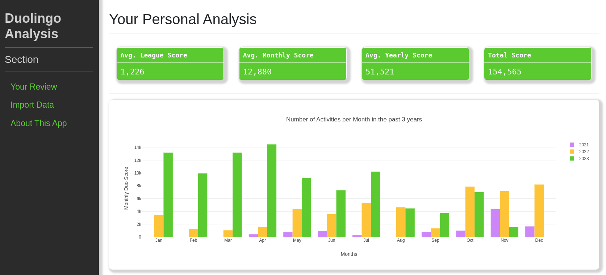

# Duolingo Data Analysis Tool

---

### Version: 0.0.1

### Author:  Finance Nik

### Date:    13.11.2023

### License: MIT

---

## Description

Have you ever dreamed of analyzing your progress in Duolingo more thoroughly then what's possible within the official
Duolingo app? Well, I might just have the solution for you! 

This tool allows you to analyze your Duolingo data. You
simply download your own Duolingo data and then run this tool to
in order to get deep insights into your language learning progress.

---

## Step-by-step guide
1. Download your Duolingo data from [here](https://www.duolingo.com/settings/account) (you need to be logged in)
2. Scroll down to the "Export My Data" section and click on "Request Export" (Export can take up to 30 Days, but usually
   takes only a few hours)
3. Unzip the downloaded file
4. Run the tool with the following command: python3 main.py
5. Go to the import data section and select the unzipped file
6. Upload your data and go to the "your review" section
7. Choose whether to analyze data as a whole or by language 
8. Enjoy the insights!
---